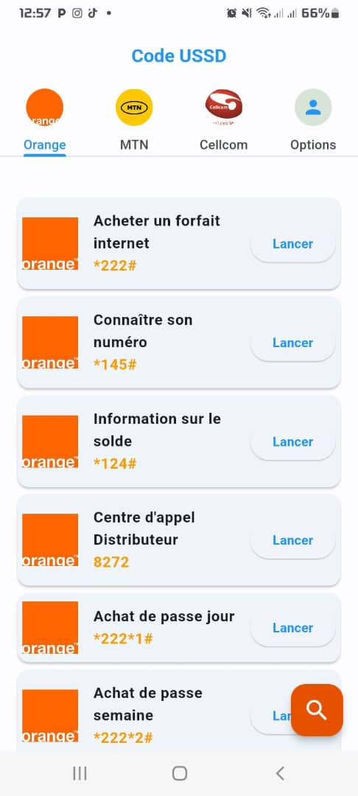
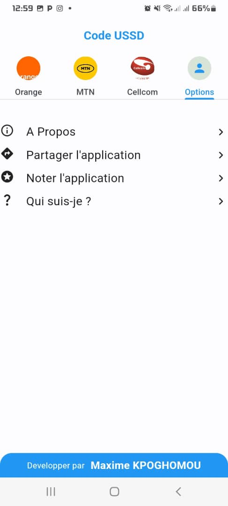

# 📱 Application Mobile – Gestion des Codes USSD

Ce projet Flutter est une application mobile conçue pour faciliter l’accès, la gestion et l’utilisation des **codes USSD** en Guinée. Elle centralise les codes les plus utilisés des opérateurs mobiles locaux (achat de crédit, forfaits, transfert, consultation de solde, etc.) dans une interface simple, rapide et accessible hors connexion.

## 🚀 Fonctionnalités principales

- 📲 Consultation rapide des codes USSD par catégorie
- ✅ Exécution directe des codes depuis l’application
- 🌍 Prise en charge multi-opérateurs (Orange, MTN, Cellcom, etc.)
- 🔍 Recherche de services et navigation intuitive
- 💾 Interface légère et utilisation hors ligne

## 🛠️ Technologies utilisées

- **Flutter** (Dart)
- **Material Design**
- **Gestion locale des données**
- Prêt pour intégration future avec API externe

## 📸 Captures d’écran

> *(à ajouter une fois les images placées dans le dossier `screenshots/`)*

  
*Écran d’accueil avec accès rapide aux catégories de codes*

  
*Affichage des détails et exécution du code USSD*

*Parametre de l'application*

## 🧠 Objectifs du projet

Ce projet a été réalisé dans le but :
- d’offrir un outil utile pour les utilisateurs mobiles en Guinée,
- d’explorer le développement mobile hybride avec Flutter,
- et de démontrer l’intégration de fonctions système spécifiques comme l’appel de codes USSD.

## 📂 Structure du projet

- `/lib/` : logique principale de l’application
- `/screenshots/` : captures d’écran pour démonstration
- `/assets/` : icônes, images, etc.

## 📌 Statut

✅ **Projet fonctionnel**  
🔧 **Améliorations prévues** : personnalisation par opérateur, historique, favoris, intégration API USSD (via gateway)

---

## 📬 Contact

Développé par **Maxime Kpoghomou**  
📧 [maximekpoghomou18@email.com]  
🔗 [Lien vers mon portfolio](https://magoe-176b4.web.app)

---

